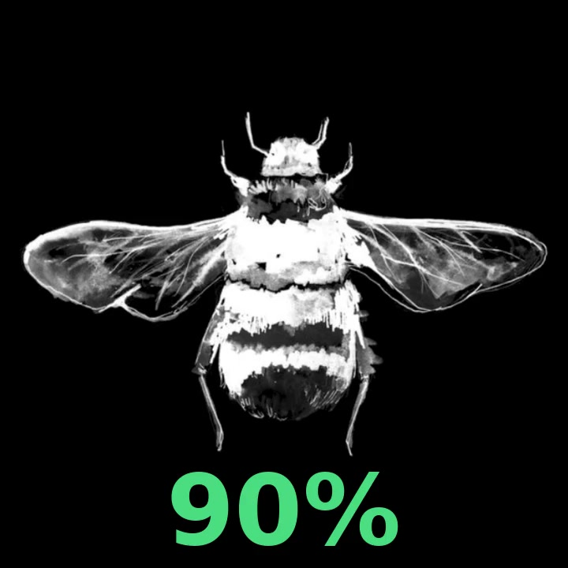

# TWS PERCENT

**A branded Android widget for Bluetooth earbuds battery visibility — created as a digital touchpoint for DVORAH.**

TWS PERCENT is a focused Android utility that turns a practical need into a recurring brand interaction: the listener sees the battery status of their earbuds directly on the home screen while staying connected to the visual identity and social channels of **DVORAH**.

> A small utility with a deliberate product role: useful every day, recognizable at a glance, and connected to the artist's ecosystem.

## Product concept

The app combines three layers:

1. **Utility** — a glanceable home-screen widget for earbuds battery status.
2. **Brand experience** — a custom visual system inspired by DVORAH's industrial music identity.
3. **Conversion path** — direct access to Linktree and Youtube from the app's internal screen.

This makes the widget more than a battery indicator: it is a lightweight branded touchpoint that can remain present on a listener's device.

## Highlights

- Android home-screen widget with a 1×1 starting size.
- Horizontal and vertical resizing supported by the launcher.
- Automatic refresh scheduled for approximately every 5 minutes.
- Immediate refresh when the widget is tapped.
- Adaptive percentage typography for different widget sizes.
- Color-coded battery status:
  - Green: 70%–100%
  - Yellow: 30%–69%
  - Red: 0%–29%
  - White: battery level unavailable
- Rounded widget presentation with the bee mark as the visual symbol.
- Dedicated DVORAH screen with industrial artwork, permission guidance and social links.
- Visual buttons labeled **Linktree** and **Youtube**.

## Visual preview

### Widget

The widget is designed for quick recognition on the Android home screen, with the bee mark in the background and a color-coded battery percentage overlaid on top.



### DVORAH app screen

The internal screen turns the utility into a branded music touchpoint, connecting Bluetooth permission, DVORAH's visual identity and direct social access.


## Experience flow

```text
Install app
    ↓
Grant nearby-device Bluetooth permission
    ↓
Add TWS PERCENT to the home screen
    ↓
See battery status at a glance
    ↓
Open DVORAH links when desired
```

## Permissions and privacy

On Android 12 and newer, the app requests only the Bluetooth permissions needed to inspect nearby paired devices:

- `BLUETOOTH_CONNECT`
- `BLUETOOTH_SCAN`

The app does **not** request location, camera, microphone, contacts or personal file access. The social buttons open external URLs and do not require account credentials inside TWS PERCENT.

## Technical notes

The project uses a native Android App Widget provider and `AlarmManager` for periodic refresh. Because Android does not expose one uniform battery API for every earbud manufacturer, the current MVP reads the battery level exposed by the paired Bluetooth device on the handset.

Depending on the model, a device may expose only the case level, only one earbud, or no battery level at all. Android power-saving modes and manufacturer-specific background restrictions can also delay scheduled refreshes.

The next technical evolution would be a GATT-based Battery Service implementation with manufacturer-specific handling for left earbud, right earbud and charging case.

## Build and run

### Android Studio

1. Clone or download this repository.
2. Open the project folder in Android Studio.
3. Wait for Gradle sync to finish.
4. Run the app on an Android device or emulator.
5. Grant Bluetooth access when requested.
6. Open the Android widget picker and add **TWS PERCENT**.

### Command line

```bash
./gradlew assembleDebug
```

The debug APK is generated at:

```text
app/build/outputs/apk/debug/app-debug.apk
```

APK files are intentionally excluded from Git tracking. Releases should be attached through GitHub Releases rather than committed into the source tree.

## Test APK

An installable debug build is available in the public GitHub Release:

**[Download TWS PERCENT 1.2.3 test APK](https://github.com/luke-fraktur/tws-percent/releases/tag/v1.2.3-test)**

This build is intended for device testing and is not a Google Play production release. Android may ask for permission to install an APK downloaded from outside the Play Store. After installation, grant access to nearby Bluetooth devices and add the widget from the Android home-screen widget picker.

### Signed test release

A release-signed test build is also available:

**[Download signed TWS PERCENT 1.2.3 APK](https://github.com/luke-fraktur/tws-percent/releases/tag/v1.2.3-release)**

The signed release is protected by an Android signing key kept outside the repository. The certificate fingerprint and file SHA-256 are published in the release notes so the downloaded artifact can be independently checked. The private signing key is never committed to GitHub.

## Repository structure

```text
app/src/main/java/              Activity and widget provider logic
app/src/main/res/layout/        Widget and internal screen layouts
app/src/main/res/drawable/      Vector icons and shape backgrounds
app/src/main/res/drawable-nodpi/Brand artwork and non-scaled visual assets
app/src/main/res/xml/           App Widget provider configuration
```

## Brand links

- Linktree: https://linktr.ee/dvorah.ofc
- Youtube: https://youtube.com/@luke.fraktur

## Roadmap

- [ ] GATT Battery Service support.
- [ ] Separate left, right and case battery levels.
- [ ] Manufacturer-specific compatibility profiles.
- [ ] In-app settings for refresh behavior and widget appearance.
- [ ] Automated tests for battery parsing and widget updates.
- [ ] Signed release build and store metadata.

## Project status

This is a working personal MVP and portfolio project. The code is intentionally small and focused, while the visual layer demonstrates how a utility can support an artist's identity and audience journey.

## Release security

Debug APKs are provided for development testing. Release APKs are signed separately, and their signing material remains outside source control. A modified APK cannot be presented as a valid update signed by the official release key. This does not prevent third parties from repackaging and redistributing a modified copy under a different signature; users should download builds only from the official GitHub Releases page.

## License

No open-source license has been selected yet. Until a license is added, the repository should be treated as **all rights reserved**. Add a license only after deciding how you want others to reuse the code and brand assets.
